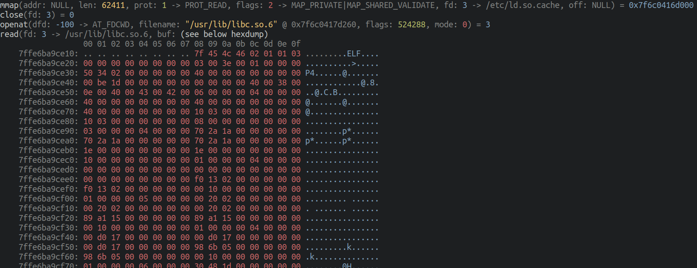

# grace

_grace_ is a tool for monitoring and modifying syscalls for a given process.

It's essentially a lightweight [strace](https://en.wikipedia.org/wiki/Strace), in Go, with colours and pretty output.



// TODO: new screenshot

## Features/Usage Examples

### grace vs. strace

_grace_ isn't meant to compete with _strace_, it's purely meant to be a user-friendly, lightweight alternative. However, the following should provide a rough idea of what is supported in _grace_ so far.

| Feature                                                                               | grace | strace |
|---------------------------------------------------------------------------------------|-------|--------|
| Start a program and print all syscalls it makes                                       | ✅     | ✅      |
| Attach to an existing process by `pid` and print all syscalls it makes                | ✅     | ✅      |
| Filter syscalls by name, e.g. only show occurrences of the `open` syscall             | ❌     | ✅      |
| Filter syscalls using a given path, e.g. only show syscalls that access `/etc/passwd` | ❌     | ✅      |
| Dump I/O for certain file descriptors                                                 | ❌     | ✅      |
| Count occurrences and duration of all syscalls and present in a useful format         | ❌     | ✅      |
| Print relative/absolute timestamps                                                    | ❌     | ✅      |
| Tamper with syscalls                                                                  | ❌     | ✅      |
| Print extra information about file descriptors, such as path, socket addresses etc.   | some  | ✅      |
| Print stack traces                                                                    | ❌     | ✅      |
| Filter by return value                                                                | ❌     | ✅      |
| Decode SELinux context info                                                           | ❌     | ✅      |
| Pretty colours to make output easier to read                                          | ✅     | ❌      |

### Usage Examples

```
// TODO
```

## Installation

Grab a statically compiled binary from the [latest release](https://github.com/liamg/grace/releases/latest).

## Build Dependencies

If you want to build _grace_ yourself instead of using the precompiled binaries, you'll need a recent version of Go (1.19+), `musl-gcc` installed (you can install `musl-tools` on Ubuntu or `musl` on Arch), and kernel headers (install `linux-headers-$(uname -r)` on Ubuntu or `linux-headers` on Arch). _grace_ mainly just pulls constants from the kernel headers, so it's not a huge dependency. You should then have some success running `make build`. Note that many architectures are not yet supported (see below.)

## Supported Platforms/Architecture

Currently only Linux/amd64 is supported. Other architectures coming soon.

If you'd like to implement a new architecture, you can duplicate `tracer/sys_amd64.go` and convert it to contain the syscall definitions for your arch.
