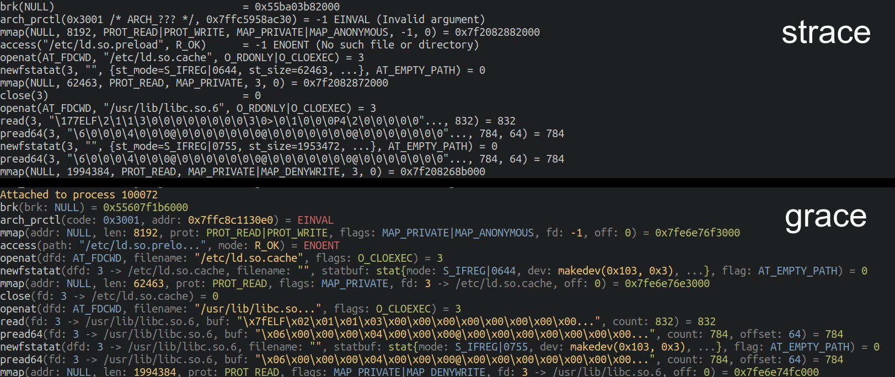
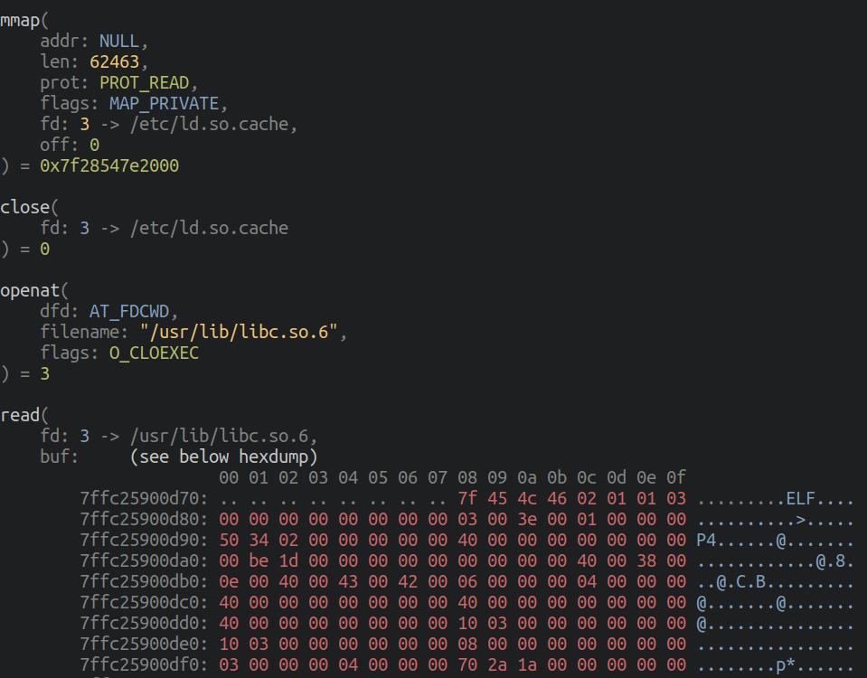
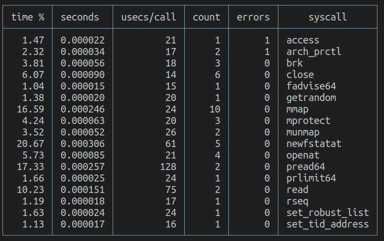

# grace

_grace_ is a tool for monitoring and annotating syscalls for a given process.

It's essentially a lightweight [strace](https://en.wikipedia.org/wiki/Strace), in Go, with colours and pretty output.

<p align="center">

</p>

<p align="center">

</p>

It's possible to tweak and filter the output to make it quite readable, for example (using `-vnmx`):

<p align="center">

</p>

You can also review a summary of encountered syscalls (and sort by various columns):

<p align="center">

</p>


### grace vs. strace

_grace_ isn't meant to compete with _strace_, it's purely meant to be a user-friendly, lightweight alternative. However, the following should provide a rough idea of what is supported in _grace_ so far.

Over time grace is meant to become a simpler, more readable alternative to strace (_strace for dummies?_), albeit with reduced functionality/advanced features.

| Feature                                                                               | grace | strace |
|---------------------------------------------------------------------------------------|-------|--------|
| Start a program and print all syscalls it makes                                       | ✅     | ✅      |
| Attach to an existing process by `pid` and print all syscalls it makes                | ✅     | ✅      |
| Filter syscalls by name, e.g. only show occurrences of the `open` syscall             | ✅     | ✅      |
| Filter syscalls using a given path, e.g. only show syscalls that access `/etc/passwd` | ✅     | ✅      |
| Dump I/O for certain file descriptors                                                 | ✅     | ✅      |
| Count occurrences and duration of all syscalls and present in a useful format         | ✅     | ✅      |
| Print relative/absolute timestamps                                                    | ✅     | ✅      |
| Tamper with syscalls                                                                  | ❌     | ✅      |
| Print extra information about file descriptors, such as path, socket addresses etc.   | ✅     | ✅      |
| Print stack traces                                                                    | ❌     | ✅      |
| Filter by return value                                                                | ✅     | ✅      |
| Pretty colours to make output easier to read                                          | ✅     | ❌      |
| Lots of output options and customisation vectors                                      | ✅     | ✅      |
| Output to file                                                                        | ✅     | ✅      |
| Filter by failing/non-failing syscalls                                                | ✅     | ✅      |

_NOTE: Please feel free to add important strace features to this table, I'm working with a limited knowledge of strace._


## Installation

Grab a statically compiled binary from the [latest release](https://github.com/liamg/grace/releases/latest).

## Supported Platforms/Architecture

Currently only Linux/amd64 is supported. Other architectures coming soon.

If you'd like to implement a new architecture, you can duplicate `tracer/sys_amd64.go` and convert it to contain the syscall definitions for your arch.

### Usage Examples

#### Trace a program

```bash
grace -- cat /dev/null  # replace 'cat /dev/null' with your program
```

#### Trace an existing process

```bash
grace -p 123 # replace 123 with your pid

# e.g. you could use pgrep to find the pid of a process
grace -p `pgrep ping`
```

#### Trace a program and filter by syscall name

```bash
grace -f "name=openat" -- cat /dev/null 

# you can also look for multiple syscalls
grace -f "name=openat&name=close" -- cat /dev/null
```

#### Trace a program and filter by syscall name and path

```bash
grace -f "name=openat&path=/dev/null" -- cat /dev/null
```

#### Trace a program and wire up stdin/out/err with the terminal

```bash
grace -F -- cat
```

#### Trace a program with maximum readability options

```bash
grace -vnmx -- cat /dev/null
```

#### Trace only failing syscalls

```bash
grace -Z -- cat /dev/null 
```

#### Show a summary of syscalls with durations, counts and errors

```bash
grace -S -- cat /dev/null
```

## Build Dependencies

If you want to build _grace_ yourself instead of using the precompiled binaries, you'll need a recent version of Go (1.19+). Then `make build` is your friend.
